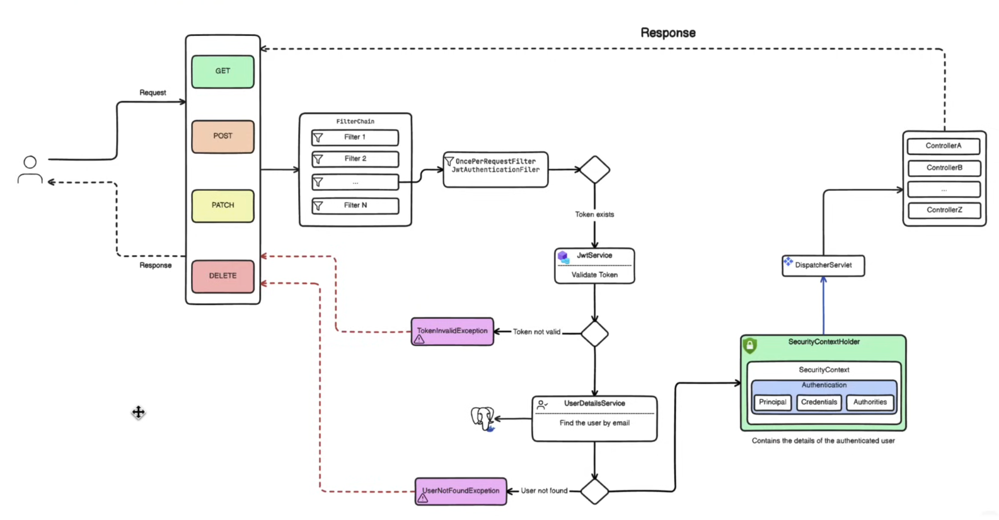
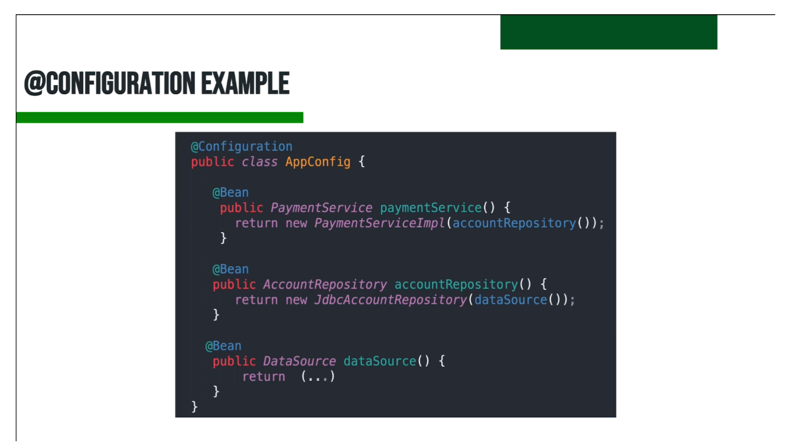
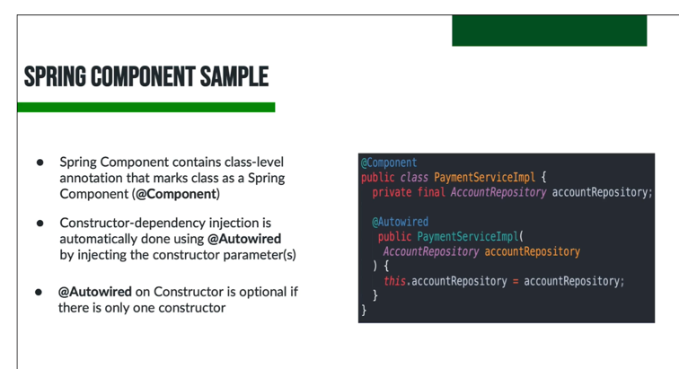
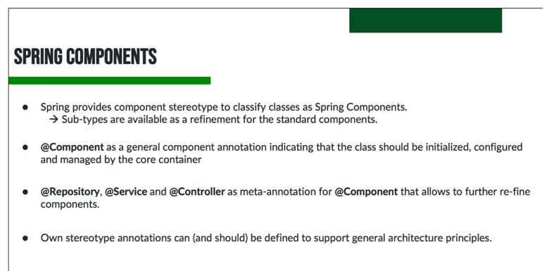
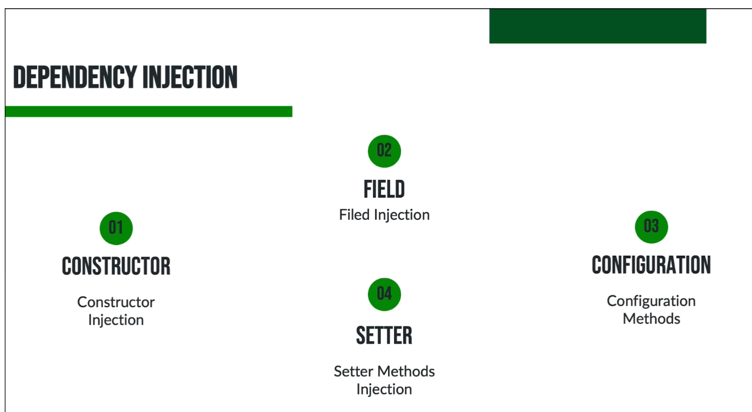

docker compose up -d

https://github.com/ali-bouali/book-social-network

# Be Security Architecture




# Some notes about spring

- Bean("ds") 로 하면 ds 라는 이름으로 빈을 등록하고 @Qualifier("ds") 로 주입받을 수 있다. 명칭이 없으면 메소드 이름으로 빈을 등록한다.

---


- 의존성 주입을 통해 외부에서 필요한 빈(Bean)을 주입받아야 한다면 생성자를 사용해야 합니다.
- 생성자가 하나뿐인 경우 @Autowired 어노테이션을 생략해도 문제없이 의존성 주입이 이루어집니다

---



---



- Constructor Injection
```java
import org.springframework.stereotype.Component;

@Component
public class ConstructorInjectionExample {

    private final SomeDependency someDependency;

    // 의존성 주입을 위한 생성자
    public ConstructorInjectionExample(SomeDependency someDependency) {
        this.someDependency = someDependency;
    }

    public void doSomething() {
        someDependency.perform();
    }
}
```

- Setter Injection
```java
import org.springframework.beans.factory.annotation.Autowired;
import org.springframework.stereotype.Component;

@Component
public class SetterInjectionExample {

    private SomeDependency someDependency;

    // 의존성 주입을 위한 세터 메소드
    @Autowired
    public void setSomeDependency(SomeDependency someDependency) {
        this.someDependency = someDependency;
    }

    public void doSomething() {
        someDependency.perform();
    }
}
```

- Field Injection
```java
import org.springframework.beans.factory.annotation.Autowired;
import org.springframework.stereotype.Component;

@Component
public class FieldInjectionExample {

    @Autowired
    private SomeDependency someDependency;

    public void doSomething() {
        someDependency.perform();
    }
}
```

- Constructor Injection이 가장 권장되는 방법이다. 생성자를 통해 의존성을 주입받으면 해당 클래스의 객체가 생성될 때 의존성이 해결되어야 하기 때문이다. Setter Injection은 객체 생성 후에 의존성을 주입받기 때문에 객체의 상태가 변할 수 있고, Field Injection은 테스트하기 어렵다는 단점이 있다.
```java
import org.springframework.context.annotation.Bean;
import org.springframework.context.annotation.Configuration;

@Configuration
public class ConfigurationMethodsInjection {

    @Bean
    public SomeDependency someDependency() {
        return new SomeDependency();
    }

    @Bean
    public ConfigurationExample configurationExample(SomeDependency someDependency) {
        return new ConfigurationExample(someDependency);
    }
}

public class ConfigurationExample {

    private final SomeDependency someDependency;

    public ConfigurationExample(SomeDependency someDependency) {
        this.someDependency = someDependency;
    }

    public void doSomething() {
        someDependency.perform();
    }
}
```

--- 

