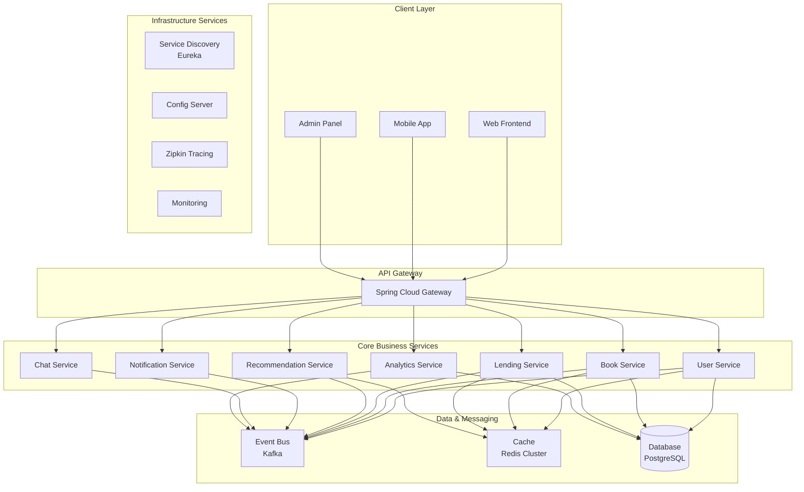

# 마이크로서비스 아키텍처 설계

## 📋 서비스 분해 전략

### 🎯 Domain-Driven Design 기반 서비스 분해



## 🏗️ 서비스별 책임과 경계

### 1. User Service (사용자 서비스)
```yaml
포트: 8081
책임:
  - 사용자 인증 및 권한 관리
  - JWT 토큰 발급 및 검증
  - 사용자 프로필 관리
  - 소셜 기능 (팔로우, 친구)

API:
  - POST /api/users/register
  - POST /api/users/login
  - GET /api/users/{id}/profile
  - POST /api/users/{id}/follow

데이터베이스:
  - users 테이블
  - user_roles 테이블
  - user_follows 테이블
```

### 2. Book Service (도서 서비스)
```yaml
포트: 8082
책임:
  - 도서 정보 관리 (CRUD)
  - 도서 검색 및 필터링
  - 도서 카테고리/장르 관리
  - 도서 메타데이터 관리

API:
  - GET /api/books
  - GET /api/books/{id}
  - POST /api/books/search
  - GET /api/books/categories

데이터베이스:
  - books 테이블
  - categories 테이블
  - book_authors 테이블
```

### 3. Lending Service (대여 서비스)
```yaml
포트: 8083
책임:
  - 도서 대여/반납 관리
  - 대여 이력 추적
  - 연체 관리
  - 예약 시스템

API:
  - POST /api/lending/borrow
  - POST /api/lending/return
  - GET /api/lending/history
  - POST /api/lending/reserve

데이터베이스:
  - book_transactions 테이블
  - reservations 테이블
  - lending_history 테이블
```

### 4. Recommendation Service (추천 서비스)
```yaml
포트: 8084
책임:
  - AI 기반 개인화 추천
  - 협업 필터링 알고리즘
  - 추천 결과 캐싱
  - 추천 품질 분석

API:
  - GET /api/recommendations/personal/{userId}
  - GET /api/recommendations/trending
  - POST /api/recommendations/feedback

데이터베이스:
  - recommendations 테이블
  - user_preferences 테이블
  - recommendation_feedback 테이블
```

### 5. Notification Service (알림 서비스)
```yaml
포트: 8085
책임:
  - 실시간 알림 전송 (SSE/WebSocket)
  - 이메일/SMS 알림
  - 알림 히스토리 관리
  - 알림 설정 관리

API:
  - GET /api/notifications/stream
  - POST /api/notifications/send
  - GET /api/notifications/history

데이터베이스:
  - notification_messages 테이블
  - notification_settings 테이블
```

### 6. Chat Service (채팅 서비스)
```yaml
포트: 8086
책임:
  - 실시간 채팅 (WebSocket)
  - 채팅방 관리
  - 메시지 히스토리
  - 파일 공유

API:
  - WebSocket /ws/chat
  - GET /api/chat/rooms
  - POST /api/chat/rooms

데이터베이스:
  - chat_rooms 테이블
  - chat_messages 테이블
  - chat_participants 테이블
```

### 7. Analytics Service (분석 서비스)
```yaml
포트: 8087
책임:
  - 사용자 행동 분석
  - 대시보드 데이터 제공
  - 통계 및 리포트 생성
  - 데이터 마이닝

API:
  - GET /api/analytics/dashboard/{type}
  - POST /api/analytics/events
  - GET /api/analytics/reports

데이터베이스:
  - user_behavior_events 테이블
  - analytics_reports 테이블
```

## 🔄 서비스 간 통신 패턴

### 1. 동기 통신 (HTTP/REST)
```yaml
사용 사례:
  - 사용자 프로필 조회
  - 도서 정보 조회
  - 실시간 응답이 필요한 경우

구현:
  - OpenFeign 클라이언트
  - Circuit Breaker (Resilience4j)
  - Load Balancing (Ribbon)
```

### 2. 비동기 통신 (Event-Driven)
```yaml
사용 사례:
  - 도서 대여 시 알림 발송
  - 사용자 행동 분석 데이터 수집
  - 추천 엔진 학습 데이터 전송

구현:
  - Apache Kafka
  - Event Sourcing
  - CQRS 패턴
```

## 🛡️ 분산 시스템 패턴

### 1. Circuit Breaker Pattern
```yaml
목적: 의존 서비스 장애 시 연쇄 장애 방지
구현: Resilience4j
설정:
  - 실패 임계치: 50%
  - 대기 시간: 10초
  - 반열림 요청 수: 5개
```

### 2. Saga Pattern
```yaml
목적: 분산 트랜잭션 관리
사용 사례: 도서 대여 프로세스
단계:
  1. 대여 기록 생성 (Lending Service)
  2. 재고 감소 (Book Service)
  3. 알림 발송 (Notification Service)
  4. 분석 데이터 수집 (Analytics Service)
```

### 3. Event Sourcing
```yaml
목적: 이벤트 기반 상태 관리
적용 서비스: Lending, Analytics
이벤트 유형:
  - BookBorrowedEvent
  - BookReturnedEvent
  - UserRegisteredEvent
  - RecommendationClickedEvent
```

## 🔧 데이터 관리 전략

### 1. Database per Service
```yaml
User Service: PostgreSQL (사용자 데이터)
Book Service: PostgreSQL (도서 정보)
Lending Service: PostgreSQL (거래 데이터)
Recommendation Service: MongoDB (비정형 데이터)
Chat Service: MongoDB (메시지 데이터)
Analytics Service: ClickHouse (시계열 데이터)
```

### 2. Data Synchronization
```yaml
방법: Event-Driven Data Sync
도구: Kafka Connect, Debezium
전략:
  - 실시간 동기화: 중요 데이터
  - 배치 동기화: 분석 데이터
  - 최종 일관성: 대부분의 읽기 전용 데이터
```

## 🚀 배포 및 운영

### 1. Containerization
```dockerfile
# 각 마이크로서비스별 Dockerfile
FROM openjdk:17-jdk-slim
COPY target/service.jar app.jar
EXPOSE 8080
ENTRYPOINT ["java", "-jar", "/app.jar"]
```

### 2. Kubernetes 배포
```yaml
# k8s-deployment.yaml
apiVersion: apps/v1
kind: Deployment
metadata:
  name: user-service
spec:
  replicas: 3
  selector:
    matchLabels:
      app: user-service
  template:
    metadata:
      labels:
        app: user-service
    spec:
      containers:
      - name: user-service
        image: book-network/user-service:latest
        ports:
        - containerPort: 8081
        env:
        - name: EUREKA_SERVER
          value: "http://eureka-server:8761/eureka"
```

## 📊 모니터링 및 관측성

### 1. 분산 추적
```yaml
도구: Zipkin + Sleuth
추적 대상:
  - 서비스 간 호출
  - 데이터베이스 쿼리
  - 외부 API 호출
  - Kafka 메시지 처리
```

### 2. 메트릭 수집
```yaml
도구: Prometheus + Grafana
메트릭:
  - 서비스별 응답 시간
  - 에러율
  - 처리량 (TPS)
  - 리소스 사용률
```

### 3. 로그 집계
```yaml
도구: ELK Stack (Elasticsearch, Logstash, Kibana)
로그 유형:
  - 애플리케이션 로그
  - 액세스 로그
  - 에러 로그
  - 감사 로그
```

## 🔐 보안 전략

### 1. 서비스 간 인증
```yaml
방법: mTLS (mutual TLS)
인증서 관리: cert-manager
서비스 메시: Istio
```

### 2. API 보안
```yaml
API Gateway 수준:
  - JWT 토큰 검증
  - Rate Limiting
  - CORS 설정
  - DDoS 방어
```

### 3. 데이터 보안
```yaml
암호화:
  - 전송 중: TLS 1.3
  - 저장 시: AES-256
민감 정보: Vault/Secrets Manager
```

이제 실제 구현을 시작하겠습니다!